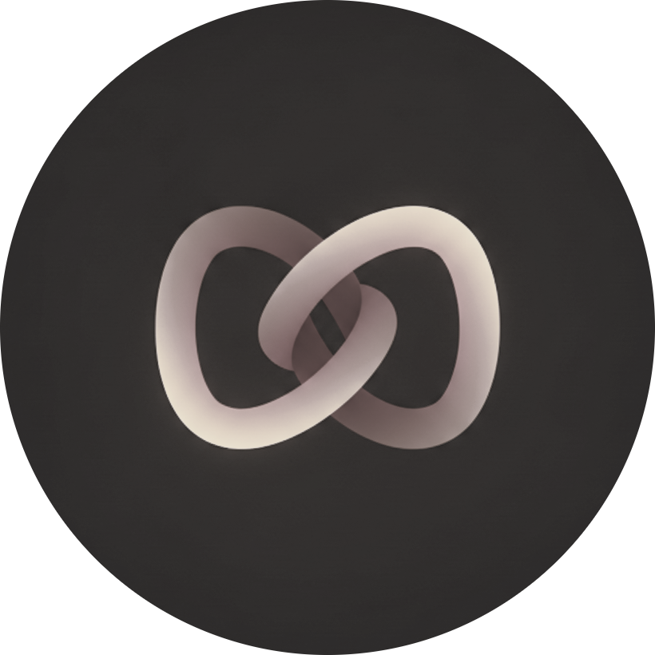
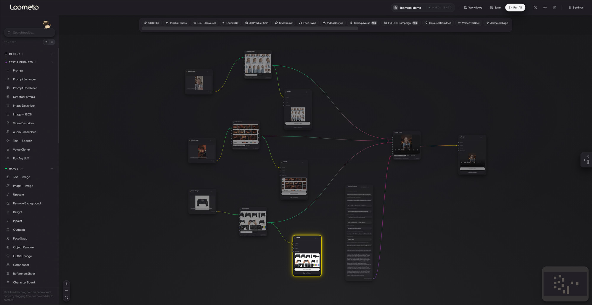
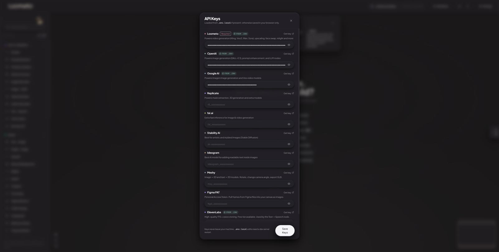
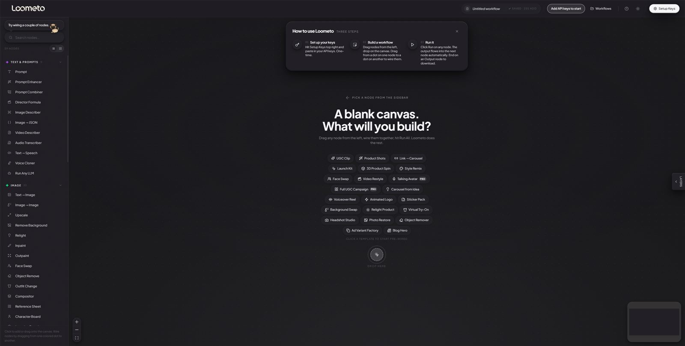
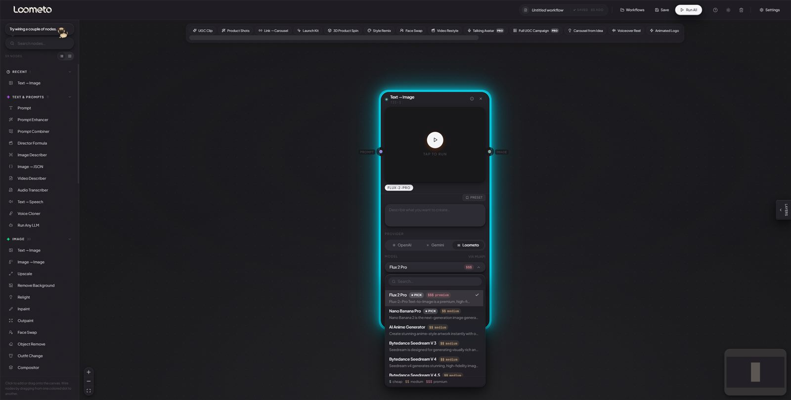
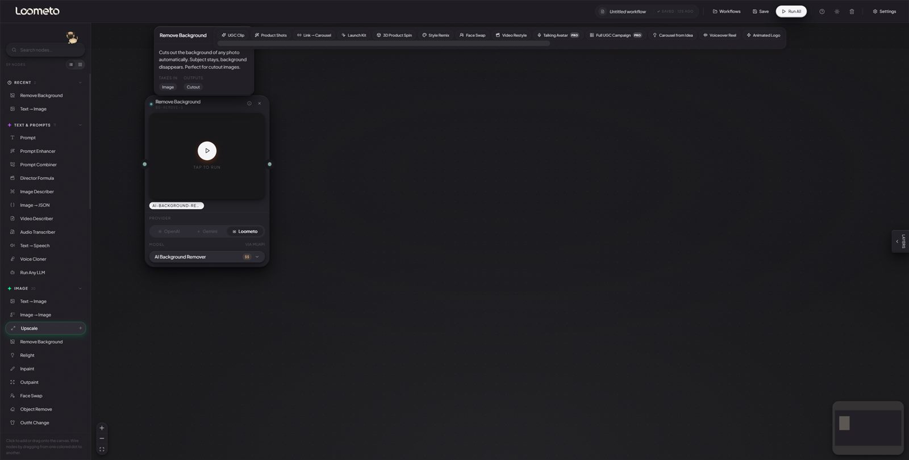
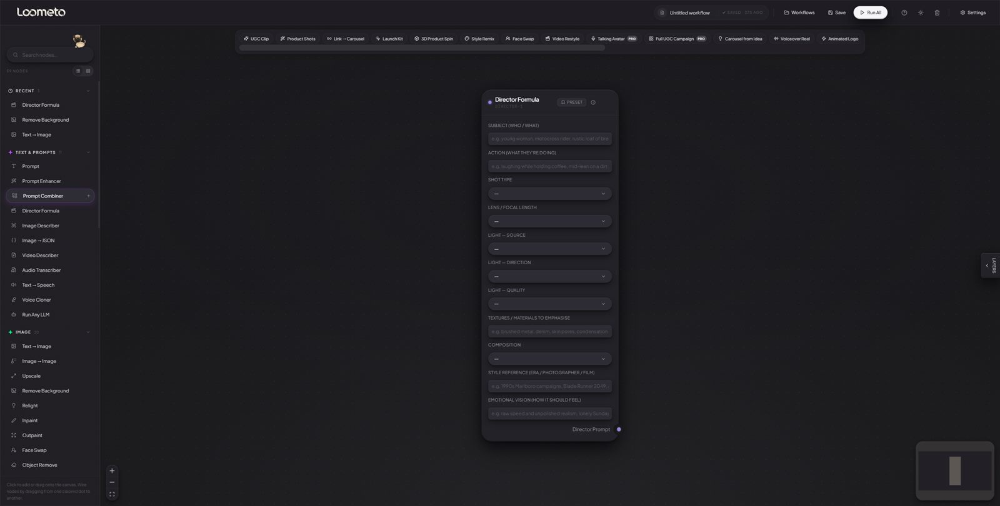

<div align="center">



<picture>
  <source media="(prefers-color-scheme: dark)" srcset="docs/brand/loometo-wordmark-cream.png">
  
</picture>

**An open-source, node-based AI creative studio. Bring your own keys.**

Wire image, video, 3D, and audio models into visual pipelines on a canvas —
then let your AI coding agent build those pipelines for you.

[](./LICENSE)
[](https://nextjs.org)
[](./mcp)
[](#the-model-catalog--all-276)

*Made by [Dinimiciuil Labs](https://dinimiciuillabs.com).*



*A real pipeline: reference boards + Director Formula feeding image → video, with finished outputs at every stage.*

</div>

---

Loometo is a visual canvas for AI generation. Drag nodes, connect them, hit
Run. It's **model-agnostic** — one MuAPI key routes to hundreds of models
(Kling, Veo, Sora, Wan, Flux, Nano Banana, Tripo, and more), and you pay
providers directly at cost instead of a per-credit platform markup.

Think ComfyUI, but friendlier — with audio, 3D, ready-made templates, prompting
help built in, and one thing no other node canvas has: **your coding agent can
drive it.**

## Table of contents

- [What makes it different](#what-makes-it-different)
- [Quick start](#quick-start)
- [API keys — where each one comes from](#api-keys--where-each-one-comes-from)
- [The tour, in five screens](#the-tour-in-five-screens)
- [Drive it from Claude Code / Codex / Cursor](#drive-it-from-claude-code--codex--cursor)
- [22 one-click pipeline templates](#22-one-click-pipeline-templates)
- [All 57 nodes, in plain English](#all-57-nodes-in-plain-english)
- [The model catalog — all 276](#the-model-catalog--all-276)
- [Architecture & security](#architecture--security)
- [License & branding](#license--branding)

## What makes it different

- **Batteries included.** Not just image + video. Text-to-speech and voice
  cloning, image → 3D (rotate in-node + export GLB/STL), 22 pre-wired pipeline
  templates, a director-formula prompt builder, and model-recommendation hints —
  out of the box.
- **Your agent builds the canvas.** Point Claude Code, Codex, or Cursor at the
  built-in MCP server and say *"build me a UGC pipeline."* Nodes appear and
  wire themselves live in your browser. (See [`mcp/`](./mcp).)
- **Model-agnostic, no lock-in.** Swap any model the day it launches. Loometo
  is the layer over the whole market, not a bet on one lab.
- **Your keys, your machine.** No accounts, no database, no telemetry. Keys
  stay in your browser or your `.env.local`. It runs entirely locally.

## Quick start

```bash
git clone https://github.com/dinimiciuillabs-cloud/loometo.git
cd loometo
npm install
npm run dev                     # http://localhost:3005
```

Then open the app, hit **Setup Keys** (top right), paste your
[MuAPI key](https://muapi.ai), and Save. That's it — no config files needed.
That single key unlocks ~80% of Loometo.

**Prefer config files?** `cp .env.example .env.local`, add `MUAPI_API_KEY`,
restart the dev server. `.env.local` always wins over pasted keys.

## API keys — where each one comes from

Every key can be pasted in-app under **Settings → API Keys** (stored in your
browser, sent only to your own localhost server). Three can *also* go in
`.env.local`:

| Provider | Powers | Get your key | In-app paste | `.env.local` |
|---|---|---|---|---|
| **MuAPI** (required) | Video, 3D, upscale, image edit, face swap, lip sync — the ~250-model catalog | [muapi.ai](https://muapi.ai) | ✅ | ✅ `MUAPI_API_KEY` |
| Google AI | Imagen 4, Veo 3, Gemini — direct, no reseller markup | [aistudio.google.com/apikey](https://aistudio.google.com/apikey) | ✅ | ✅ `GOOGLE_API_KEY` |
| ElevenLabs | TTS + voice cloning (free tier available) | [elevenlabs.io → API keys](https://elevenlabs.io/app/settings/api-keys) | ✅ | ✅ `ELEVENLABS_API_KEY` |
| OpenAI | GPT-Image / DALL·E, LLM nodes | [platform.openai.com/api-keys](https://platform.openai.com/api-keys) | ✅ | — |
| Meshy | Direct image → 3D (cheapest 3D path) | [meshy.ai/api/keys](https://www.meshy.ai/api/keys) | ✅ | — |
| Figma | Pull frames onto the canvas | [figma.com → access tokens](https://www.figma.com/settings#personal-access-tokens) | ✅ | — |



> Optional: set Cloudflare `R2_*` keys in `.env.local` and every generated
> asset is auto-copied to your own bucket — provider URLs expire in 24–72h,
> this makes them permanent.

## The tour, in five screens

### You're never staring at an empty grid

First launch: a three-step explainer, all 22 templates one click away, and a
search over all 57 nodes.



### Model intelligence, inside the node

Searchable picker with **★ PICK** recommendations and **$ / $$ / $$$** cost
tiers on every model — before you spend a cent. Parameters below it are
schema-driven, so you can never set a value the model rejects.



### Every node explains itself

Tap the `(i)` on any of the 57 nodes: plain English, what goes in, what comes
out. Typed handles mean wires only connect where the types match.



### Prompt like a film director

The **Director Formula** node encodes real cinematography discipline — shot
codes (ECU → EWS), annotated lens bands, lighting split into source /
direction / quality like a DoP would, plus textures, composition, style
reference and emotional vision. Eleven fields in, one director-grade prompt
out, wired into any generator. Save the whole configuration as a preset.



## Drive it from Claude Code / Codex / Cursor

Loometo ships a **zero-dependency MCP server** (`mcp/loometo-mcp.mjs`,
Node 18+) wrapping its HTTP canvas bridge. Your agent reads the graph, adds
nodes, wires them, and fires runs — live in your browser tab.

```
you › build me a UGC pipeline for a street-food ad

→ snapshot()                          reads empty canvas
→ add_node(character-board)           ✓ char-board-1
→ add_node(image-to-video, kling)     ✓ i2v-1
→ connect(char-board-1 → i2v-1)       ✓
→ set_param(i2v-1, aspect 9:16)       ✓
→ run_all()                           ✓ generating…
```

**Setup (3 steps):**

1. `npm run dev` and leave the browser tab open — set your keys first
   (Setup Keys → paste → Save) or every run the agent fires will fail.
2. Register the server in your agent — use the **absolute path**:

   ```jsonc
   // Claude Code (.mcp.json or ~/.claude.json) — or:
   // claude mcp add loometo -- node /abs/path/mcp/loometo-mcp.mjs
   "mcpServers": {
     "loometo": {
       "command": "node",
       "args": ["/abs/path/to/loometo/mcp/loometo-mcp.mjs"],
       "env": { "LOOMETO_URL": "http://localhost:3005" }
     }
   }
   ```

   Codex uses the same shape in `~/.codex/config.toml`; Cursor / Cline in
   their MCP settings. Full walkthrough: [`mcp/README.md`](./mcp/README.md).
3. Reload your agent and just ask. Nodes are addressable by the name on the
   card — you can literally say *"run char-board-1"*.

**The 11 tools:** `snapshot` · `add_node` · `connect` · `set_param` ·
`run_node` · `run_all` · `delete_node` · `clear` · `select` · `pulse` ·
`list_models`

## 22 one-click pipeline templates

Every template is a pre-wired canvas — models pre-picked, prompts pre-filled
with director-formula briefs you edit in place.

| Template | What it wires | Template | What it wires |
|---|---|---|---|
| **UGC Clip** | Person + place → video | **Voiceover Reel** | Script + face → talking clip |
| **Product Shots** | One photo → angle board + cutout | **Animated Logo** | Logo → motion sting |
| **Link → Carousel** | Paste a link, post a carousel | **Sticker Pack** | Photo → 4 die-cut stickers |
| **Launch Kit** | One hero → every channel | **Background Swap** | Cut out → drop in a scene |
| **3D Product Spin** | Photo → spinnable 3D | **Relight Product** | Phone photo → studio light |
| **Style Remix** | Photo + idea → upscaled art | **Virtual Try-On** | Person + outfit idea → look |
| **Face Swap** | Two photos → swapped | **Headshot Studio** | Selfie → pro headshots |
| **Video Restyle** | Clip + idea → new look | **Photo Restore** | Old / blurry → sharp |
| **Talking Avatar** | Photo + script → talking video | **Object Remover** | Delete anything from a photo |
| **Full UGC Campaign** | Character + place + product → 3 clips | **Ad Variant Factory** | One hero → 6 ad angles |
| **Carousel from Idea** | Topic → carousel | **Blog Hero** | Article link → hero image |

## All 57 nodes, in plain English

The same explanations behind each node's `(i)` button. Click a group to expand.
<details>
<summary><b>Text & Prompts</b> — 8 nodes</summary>

| Node | What it does |
|---|---|
| **Prompt** | Type what you want to create here. Like telling the AI 'make me a sunset on a beach' — it's the starting point of everything. |
| **Prompt Enhancer** | Your prompt goes in, a better prompt comes out. The AI rewrites it with more detail so your image or video looks amazing. |
| **Audio Transcriber** | Listens to your uploaded audio and writes out the spoken script. Feed the transcript into a Prompt Combiner so the video model knows what is being said — not just lip shapes. |
| **Prompt Combiner** | Connect two prompts and this merges them into one. Useful when you have different ideas you want to blend together. |
| **Director Formula** | Fill the 7 fields like a creative director writing a brief — subject + action, shot type, lens, lighting (3 facets), composition, style ref, vision. The node assembles a director-grade prompt that wires into any image generator. Vocabulary taken verbatim from cinematography sources. |
| **Run Any LLM** | Talk to any AI brain (ChatGPT, Gemini, Claude) directly inside your workflow. Ask questions, get descriptions, or have it write prompts. |
| **Image Describer** | Give it a photo and it tells you exactly what's in it as a detailed prompt. Perfect for recreating a style. |
| **Image → JSON** | Vision LLM produces a strict JSON description of one or several images of the same subject. Wire optional Extra Instructions (positive direction: 'include hex codes', 'list every logo separately') and Negative (avoid: 'don't speculate about brands not visible'). Output JSON wires into any text input for downstream identity lock. |

</details>

<details>
<summary><b>Audio & Voice</b> — 5 nodes</summary>

| Node | What it does |
|---|---|
| **Text → Speech** | Turns a script into a spoken audio clip. Wire a Prompt with your script in, get audio out. For ElevenLabs free tier, wire a Voice Cloner in (library voices are paid-only). Pipe that into Lip Sync to make a video character say it. |
| **Voice Cloner** | Wire in a 30+ second audio sample (your voice, a podcast clip, anything clean). Give it a name. Click Clone. ElevenLabs returns a voice_id you can wire into Text → Speech for unlimited future TTS in that voice. Free tier compatible. |
| **Lip Sync** | Upload a video of a person and an audio clip — it animates their lips to match the audio. |
| **Speech → Video** | Take a portrait photo, add a voice recording, and get a video of that person speaking. Perfect for AI avatars. |
| **Upload Audio** | Pick an audio file (mp3, wav). Feed it into Lip Sync or Speech → Video. |

</details>

<details>
<summary><b>Video</b> — 7 nodes</summary>

| Node | What it does |
|---|---|
| **Video Describer** | Same as Image Describer but for videos. Watches your video and writes out what's happening so you can recreate or remix it. |
| **Text → Video** | Type what you want to see and it creates a video. The dropdown shows only what each model truly supports. |
| **Image → Video** | Animate a single photo (First Frame), wire First + Last for transition (Veo 3.1), or wire multiple references for reference-conditioned models. Ref handle count is set by the chosen model: Sora 2 / Veo 3 base = 1, Pixverse = 2, Veo 3.1 Reference = 3, Wan 2.1 Reference = 5, Vidu Q1/Q2 + Kling O1 Reference = 7, Seedance Omni = 9. Address each in the prompt as @image1..@imageN. |
| **Video → Video** | Transform a video's look completely. 'Make this look like anime' or 'make it look like 1970s film.' Same motion, new style. |
| **Video Upscale** | Makes blurry or low-quality videos look sharp and crisp. |
| **Video Matte** | Removes the background from every frame of a video automatically. Tracks your subject — like a green screen without the green screen. |
| **Upload Video** | Pick a video file (mp4, mov, webm). Feed it into Video → Video, Lip Sync, or other video tools. |

</details>

<details>
<summary><b>3D</b> — 1 nodes</summary>

| Node | What it does |
|---|---|
| **Image → 3D** | Generate a 3D mesh from one image, multiple angle photos, or a text prompt. Tripo3D H31 ($0.20-$0.30) is the cheapest; Meshy 6 ($0.50) is most detailed. Drag the mesh to rotate. After the GLB loads, a 2D snapshot is auto-captured so downstream image nodes have a usable image to consume; download serves the .glb. |

</details>

<details>
<summary><b>Import, Output & Utility</b> — 8 nodes</summary>

| Node | What it does |
|---|---|
| **Extract Frame** | Grab any single frame from a video and save it as a still image. Pick the exact moment you want — frame by frame. |
| **Painter** | Brush directly on the canvas. Paint MASKS for Inpaint / Object Remove, or sketch overlays that flow downstream as images. |
| **Import from Figma** | Paste a Figma frame URL. Right-click any frame in Figma → Copy link to selection. Hit Run to pull it in as an image. |
| **Upload Image** | Pick an image from your computer. It becomes the starting point for any image workflow. |
| **Import from URL** | Paste any website link. Free mode extracts the readable text directly ($0). Google mode uses Gemini to clean the text AND recover the page's images and logo. Tap the recovered assets to pick which ones flow into your carousel as references — a tick marks the chosen ones. |
| **Compare** | Put two images side by side with a draggable slider. Perfect for before/after. |
| **Iterator** | Run the same process on multiple images at once. Instead of generating 10 images one by one, the Iterator does them in a batch. |
| **Output** | The finish line. Connect image, video, and/or audio here to preview and download each. Pair Veo video + TTS audio here, then combine in your editor (CapCut / DaVinci). |

</details>

<details>
<summary><b>Image & Boards</b> — 28 nodes</summary>

| Node | What it does |
|---|---|
| **Text → Image** | Type a description and it draws a picture. Models that accept a STYLE REFERENCE image (Nano Banana, Flux Kontext, GPT-Image) expose a second Style Ref handle. Pure T2I models hide it. |
| **Image → Image** | Give it a photo + a description and it transforms the photo. Like 'make this look like an oil painting.' |
| **Upscale** | Makes small or blurry images bigger and sharper. It actually invents new detail — turn a tiny image into a crisp 4K masterpiece. |
| **Remove Background** | Cuts out the background of any photo automatically. Subject stays, background disappears. Perfect for cutout images. |
| **Relight** | Changes where the light is coming from in a photo. Make daytime look like sunset, or add dramatic studio lighting — without a studio. |
| **Inpaint** | Paint over something you don't want and the AI fills it in naturally. Remove people, erase logos — it blends in seamlessly. |
| **Outpaint** | Makes your image wider or taller by generating what would be outside the frame. Like zooming out — the AI imagines what's beyond the edges. |
| **Face Swap** | Put your face (or anyone's face) onto a different body or scene. Handles skin tone, lighting and angle automatically. |
| **Object Remove** | Point at anything and poof — it's gone. The AI fills in what the background looks like. Remove tourists, wires, anything. |
| **Compositor** | Visual layer editor. Wire a SCENE + up to 4 SUBJECTS, then drag / resize / reorder them in the polaroid. Two output modes: FLAT (exact pixel composite, no AI) or AI BLEND (sends the arrangement to Nano Banana Pro Edit which re-renders with matched lighting and perspective). |
| **Reference Sheet** | Feed up to 6 photos of the SAME thing (a person, a place, a product) and one prompt. The model uses them all as identity / location anchors. Better than asking one model to 'imagine four angles' from a single photo. |
| **Character Board** | Wire 1-5 photos of a person AND optionally a JSON spec from Image→JSON. Generates a studio model board (8 head expressions, 4 full-body angles, hand/eye/shoulder close-ups, fabric and skin-tone swatches) with anti-fake realism + director-formula lighting baked in. Feed the output into Image→JSON downstream to lock identity for compositors. |
| **Location Board** | Wire 1-5 photos of a place AND optionally a JSON spec. Generates a location reference board — exterior angles, time-of-day variants (golden/midday/blue/night), signage close-ups, brand swatches. Director-formula lens + 4-facet lighting baked per panel. Feed the output into Image→JSON downstream. |
| **Product Board** | Wire 1-5 photos of a product AND optionally a JSON spec. Generates a spec-board — hero angles, in-hand shots, brand-mark and material close-ups, colourway swatches. Director-formula lens + 4-facet softbox lighting baked per panel. Feed the output into Image→JSON downstream. |
| **B-roll Board** | Wire 1-5 photos of your scene / subject / product. Generates 6-9 cutaway-style frames sharing one colour grade and lighting era — hands, atmosphere details, environment beats, lifestyle moments. Use for video edit asset library or campaign supporting shots. |
| **Storyboard** | Wire 1-5 photos of your character / scene / setting + an extra-direction line describing the story beat-by-beat. Generates 6-9 numbered panels, each labelled with shot type (ECU / CU / MS / FS / LS) and a one-line action. Photoreal hero frames at pre-vis quality. |
| **Mascot Board** | Wire 1-5 photos / concept art of a brand mascot. Generates a mascot bible — 4 orthographic views (front / 3-4 / side / back), 6 expressions, 4-5 poses, brand palette swatches, face + hand detail callouts, scale reference next to a human. Locks the mascot for consistent reuse across campaigns. |
| **Creature Board** | Wire 1-5 photos / concept art of a creature, monster, or designed animal. Generates a creature concept-art bible — 5 orthographic views (front / 3-4 / side / back / top-down), face / limb / signature-feature / texture / joint detail callouts, material swatches (skin / fur / scales / feathers), threat-display + resting + hunting pose silhouettes, scale reference next to a human. |
| **Outfit Change** | Virtually try on different outfits. Describe the clothing and the AI puts it on the person. Great for fashion and e-commerce. |
| **Crop** | Cut your image or video to a specific size. Choose 16:9 for YouTube, 9:16 for TikTok, or 1:1 for Instagram. Instant, no AI needed. |
| **Blur** | Makes things fuzzy. Blur backgrounds, censor things, or create a dreamy soft-focus effect. Slide to control how blurry. |
| **Levels** | Make your image brighter, darker, or more contrasty. Like the basic sliders in your phone's photo editor but in your workflow. |
| **Invert** | Flips all colors to their opposite — like a photo negative. Black becomes white. Very useful for flipping masks. |
| **Mask Extractor** | Click on objects in your image and it automatically traces around them. Magic scissors that cut out exactly what you want. |
| **Mask by Text** | Describe what to select — 'the person's hair' or 'the car' — and it draws the selection automatically. No clicking needed. |
| **Matte Grow/Shrink** | Makes your selection slightly bigger or smaller. Use this to clean up rough edges. |
| **Merge Alpha** | Takes your image and your mask and combines them — the masked area becomes transparent. How you get cutout images with no background. |
| **Carousel Board** | Turns any text (wire in an Import from URL, or paste directly) into a ready-to-post social carousel: hook slide, point slides, CTA slide. Wire a Logo in to brand every slide and a Reference Image for the hook background. Finish 'Flat' renders locally for free; 'AI Enhance' passes each slide through Nano Banana Pro Edit (~$0.12/slide). One output handle per slide. |

</details>

## The model catalog — all 276

The catalog lives in [`public/muapi-schema.json`](./public/muapi-schema.json) —
selectors read allowed values from it, so the UI never offers a parameter a
model rejects. New model out today? Add one schema entry and it appears.

**Routing:** models run either **direct** (Google, OpenAI, Meshy, ElevenLabs —
your key, raw cost) or via the **MuAPI reseller** (one key, ~250 models).
[`lib/api/router.ts`](./lib/api/router.ts) picks the route per model.
Cost tiers — `$` cheap · `$$` medium · `$$$` premium — show on every model in
the picker.
<details>
<summary><b>Image to Video</b> — 62 models</summary>

| Model slug | Variant | Extra parameters |
|---|---|---|
| `ai-video-effects` | AI Video Effects | name, aspect_ratio, resolution, quality |
| `motion-controls` | Motion Controls | name, aspect_ratio, resolution, quality |
| `vfx` | VFX | name, aspect_ratio, resolution, quality |
| `veo3-image-to-video` | Image to Video | images_list, aspect_ratio |
| `veo3-fast-image-to-video` | Image to Video [Fast] | images_list, aspect_ratio |
| `runway-image-to-video` | Image to Video | aspect_ratio, resolution, duration |
| `wan2.1-image-to-video` | Image to Video | aspect_ratio, resolution, quality, duration |
| `midjourney-v7-image-to-video` | Image to Video | aspect_ratio, resolution, num_videos, variety |
| `hunyuan-image-to-video` | Image to Video | aspect_ratio |
| `seedance-2.0-omni-reference` | Seedance 2.0 Omni Reference | images_list, aspect_ratio, quality, duration |
| `seedance-2-vip-omni-reference-fast` | Seedance 2 VIP Omni Reference Fast | images_list, aspect_ratio, duration |
| `seedance-lite-i2v` | Lite Image to Video | last_image, resolution, duration, camera_fixed |
| `seedance-pro-i2v` | Pro Image to Video | resolution, duration, camera_fixed |
| `kling-v2.1-master-i2v` | Master Image to Video | aspect_ratio, duration |
| `kling-v2.1-standard-i2v` | Standard Image to Video | aspect_ratio, duration |
| `kling-v2.1-pro-i2v` | Pro Image to Video | last_image, aspect_ratio, duration |
| `wan2.2-image-to-video` | Image to Video | last_image, aspect_ratio, resolution, quality |
| `runway-act-two-i2v` | Act 2 Image to Video | reference_video_url, aspect_ratio |
| `pixverse-v4.5-i2v` | Image to Video | images_list, aspect_ratio, resolution, duration |
| `vidu-v2.0-i2v` | Image to Video | images_list, aspect_ratio, resolution, duration |
| `vidu-q1-reference` | Reference I2V | images_list, aspect_ratio |
| `minimax-hailuo-02-standard-i2v` | Standard I2V | end_image_url, duration, resolution |
| `minimax-hailuo-02-pro-i2v` | Pro I2V | end_image_url, duration, resolution |
| `video-effects` | Video Effects | name |
| `pixverse-v5-i2v` | Image to Video | images_list, aspect_ratio, resolution, duration |
| `seedance-lite-reference-video` | Lite Reference to Video | images_list, resolution, duration |
| `wan2.1-reference-video` | Reference to Video | images_list, resolution, aspect_ratio, duration |
| `kling-v2.5-turbo-pro-i2v` | Pro Image to Video | duration |
| `wan2.5-image-to-video` | Image to Video | resolution, duration |
| `wan2.5-image-to-video-fast` | Image to Video (Fast) | resolution, duration |
| `openai-sora-2-image-to-video` | Sora 2 Image to Video | images_list, aspect_ratio, duration, remove_watermark |
| `ovi-image-to-video` | Image to Video | prompt only |
| `openai-sora-2-pro-image-to-video` | Sora 2 Pro Image to Video | images_list, aspect_ratio, duration, resolution |
| `leonardoai-motion-2.0` | Motion 2.0 I2V | aspect_ratio |
| `higgsfield-dop-image-to-video` | Image to Video | last_image, motion, strength, options |
| `veo3.1-image-to-video` | Image to Video | last_image, aspect_ratio, duration, resolution |
| `veo3.1-fast-image-to-video` | Image to Video [Fast] | last_image, aspect_ratio, duration, resolution |
| `veo3.1-reference-to-video` | Reference to Video | images_list, resolution, duration, generate_audio |
| `seedance-pro-i2v-fast` | Pro Image to Video Fast | resolution, duration, camera_fixed |
| `ltx-2-pro-image-to-video` | Pro Image to Video | duration, generate_audio |
| `ltx-2-fast-image-to-video` | Fast Image to Video | duration, generate_audio |
| `vidu-q2-reference` | Reference I2V | images_list, resolution, aspect_ratio, duration |
| `vidu-q2-turbo-start-end-video` | Turbo I2V | last_image, resolution, duration, bgm |
| `vidu-q2-pro-start-end-video` | Pro I2V | last_image, resolution, duration, bgm |
| `minimax-hailuo-2.3-pro-i2v` | Pro I2V | resolution |
| `minimax-hailuo-2.3-standard-i2v` | Standard I2V | duration |
| `minimax-hailuo-2.3-fast` | Fast I2V | duration, go_fast |
| `kling-v2.5-turbo-std-i2v` | Standard Image to Video | duration |
| `grok-imagine-image-to-video` | Image to Video | images_list, mode, duration |
| `kling-o1-image-to-video` | Image to Video [Pro] | last_image, aspect_ratio, duration |
| `kling-o1-reference-to-video` | Reference to Video [Pro] | images_list, aspect_ratio, duration, keep_original_sound |
| `kling-v2.6-pro-i2v` | Image to Video | duration, sound |
| `pixverse-v5.5-i2v` | Image to Video | images_list, style, thinking, aspect_ratio |
| `wan2.2-spicy-image-to-video` | Spicy Image to Video | resolution, duration |
| `wan2.6-image-to-video` | Image to Video | resolution, duration, shot_type |
| `kling-o1-standard-image-to-video` | Image to Video [Standard] | last_image, duration |
| `kling-o1-standard-reference-to-video` | Reference to Video [Standard] | images_list, aspect_ratio, duration |
| `seedance-v1.5-pro-i2v` | Image to Video | last_image, aspect_ratio, resolution, duration |
| `seedance-v1.5-pro-i2v-fast` | Image to Video [Fast] | last_image, aspect_ratio, resolution, duration |
| `ltx-2-19b-image-to-video` | Std Image to Video | resolution, duration |
| `kling-v3.0-pro-image-to-video` | Image to Video [Pro] | last_image, duration, generate_audio |
| `kling-v3.0-standard-image-to-video` | Image to Video [standard] | last_image, duration, generate_audio |

</details>

<details>
<summary><b>Text to Video</b> — 44 models</summary>

| Model slug | Variant | Extra parameters |
|---|---|---|
| `veo3-text-to-video` | Text to Video | aspect_ratio |
| `veo3-fast-text-to-video` | Text to Video [Fast] | aspect_ratio |
| `runway-text-to-video` | Text to Video | aspect_ratio, resolution, duration |
| `wan2.1-text-to-video` | Text to Video | aspect_ratio, resolution, quality, duration |
| `hunyuan-text-to-video` | Text to Video | aspect_ratio |
| `hunyuan-fast-text-to-video` | Fast Text to Video | aspect_ratio |
| `seedance-lite-t2v` | Lite Text to Video | aspect_ratio, resolution, duration, camera_fixed |
| `seedance-pro-t2v` | Pro Text to Video | aspect_ratio, resolution, duration, camera_fixed |
| `kling-v2.1-master-t2v` | Master Text to Video | aspect_ratio, duration |
| `wan2.2-text-to-video` | Text to Video | aspect_ratio, resolution, quality, duration |
| `pixverse-v4.5-t2v` | Text to Video | aspect_ratio, resolution, duration |
| `vidu-v2.0-t2v` | Text to Video | aspect_ratio, resolution, duration |
| `wan2.2-5b-fast-t2v` | Fast Text to Video | aspect_ratio, resolution |
| `minimax-hailuo-02-standard-t2v` | Standard T2V | duration, resolution |
| `minimax-hailuo-02-pro-t2v` | Pro T2V | duration, resolution |
| `pixverse-v5-t2v` | Text to Video | aspect_ratio, resolution, duration |
| `kling-v2.5-turbo-pro-t2v` | Pro Text to Video | aspect_ratio, duration |
| `wan2.5-text-to-video` | Text to Video | aspect_ratio, resolution, duration |
| `wan2.5-text-to-video-fast` | Text to Video (Fast) | aspect_ratio, resolution, duration |
| `openai-sora` | Sora Text to Video | aspect_ratio, resolution |
| `openai-sora-2-text-to-video` | Sora 2 Text to Video | aspect_ratio, duration, remove_watermark |
| `ovi-text-to-video` | Text to Video | aspect_ratio |
| `openai-sora-2-pro-text-to-video` | Sora 2 Pro Text to Video | aspect_ratio, duration, resolution, remove_watermark |
| `veo3.1-text-to-video` | Text to Video | aspect_ratio, duration, resolution |
| `veo3.1-fast-text-to-video` | Text to Video [Fast] | aspect_ratio, duration, resolution |
| `openai-sora-2-pro-storyboard` | Sora 2 Pro Storyboard | shots, duration, images_list, aspect_ratio |
| `veo3.1-extend-video` | Extend Video | request_id |
| `seedance-pro-t2v-fast` | Pro Text to Video Fast | resolution, duration, aspect_ratio, camera_fixed |
| `ltx-2-pro-text-to-video` | Pro Text to Video | duration, generate_audio |
| `ltx-2-fast-text-to-video` | Fast Text to Video | duration, generate_audio |
| `minimax-hailuo-2.3-pro-t2v` | Pro T2V | resolution |
| `minimax-hailuo-2.3-standard-t2v` | Standard T2V | duration |
| `grok-imagine-text-to-video` | Text to Video | aspect_ratio, mode, duration |
| `kling-o1-text-to-video` | Text to Video [Pro] | aspect_ratio, duration |
| `kling-v2.6-pro-t2v` | Text to Video | aspect_ratio, duration, sound |
| `pixverse-v5.5-t2v` | Text to Video | style, thinking, aspect_ratio, resolution |
| `wan2.6-text-to-video` | Text to Video | aspect_ratio, resolution, duration, shot_type |
| `seedance-v1.5-pro-t2v` | Text to Video | aspect_ratio, resolution, duration, generate_audio |
| `seedance-v1.5-pro-t2v-fast` | Text to Video [Fast] | aspect_ratio, resolution, duration, generate_audio |
| `ltx-2-19b-text-to-video` | Std Text to Video | aspect_ratio, resolution, duration |
| `veo3.1-4k-video` | 4k Video | request_id |
| `kling-v3.0-pro-text-to-video` | Text to Video [Pro] | aspect_ratio, duration, generate_audio |
| `kling-v3.0-standard-text-to-video` | Text to Video [standard] | aspect_ratio, duration, generate_audio |
| `seedance-v2.0-t2v` | Seedance 2.0 | aspect_ratio, duration, quality |

</details>

<details>
<summary><b>Image to Image</b> — 56 models</summary>

| Model slug | Variant | Extra parameters |
|---|---|---|
| `ai-image-upscaler` | Image Upscaler | prompt only |
| `ai-image-face-swap` | Image Faceswap | swap_url, target_index |
| `ai-dress-change` | Dress Change | model_image_url, garment_image_url |
| `ai-background-remover` | Background Remover | prompt only |
| `ai-product-shot` | Product Shot | scene_description |
| `ai-skin-enhancer` | Skin Enhancer | prompt only |
| `ai-color-photo` | Color Photo | prompt only |
| `flux-kontext-dev-i2i` | Kontext Dev I2I | images_list, aspect_ratio, num_images |
| `ai-product-photography` | Product Photography | person_image_url, product_image_url |
| `ai-ghibli-style` | Ghibli Style | prompt only |
| `ai-image-extension` | Image Extension | prompt only |
| `ai-object-eraser` | Object Eraser | mask_image_url |
| `flux-kontext-pro-i2i` | Kontext Pro I2I | images_list, aspect_ratio |
| `flux-kontext-max-i2i` | Kontext Max I2I | images_list, aspect_ratio |
| `gpt4o-image-to-image` | Image to Image | images_list, aspect_ratio, num_images |
| `gpt4o-edit` | Edit Image | mask_image_url, aspect_ratio, num_images |
| `midjourney-v7-image-to-image` | Image to Image | speed, aspect_ratio, variety, stylization |
| `gpt-image-2-image-to-image` | GPT Image 2 (Image to Image) | images_list, aspect_ratio, resolution, quality |
| `bytedance-seededit-v3` | Edit Image v3 | prompt only |
| `midjourney-v7-style-reference` | Style Reference | speed, aspect_ratio, variety, stylization |
| `midjourney-v7-omni-reference` | Omni Reference | speed, aspect_ratio, weight, variety |
| `minimax-image-01-subject-reference` | Subject Reference | aspect_ratio, num_images |
| `ideogram-character` | Character | render_speed, style, aspect_ratio, num_images |
| `flux-pulid` | Pulid Image to Image | aspect_ratio |
| `qwen-image-edit` | Edit Image | aspect_ratio |
| `image-effects` | Image Effects | name |
| `nano-banana-edit` | Edit Image | images_list, aspect_ratio |
| `ideogram-v3-reframe` | v3 Reframe | aspect_ratio, render_speed, style, num_images |
| `bytedance-seedream-edit-v4` | Edit Image v4 | images_list, aspect_ratio, resolution, num_images |
| `nano-banana-effects` | Image Effects | name, aspect_ratio |
| `flux-kontext-effects` | Image Effects | name |
| `flux-redux` | Redux Image to Image | aspect_ratio, num_images |
| `qwen-image-edit-plus` | Edit Image Plus | images_list, width, height |
| `wan2.5-image-edit` | Edit Image | images_list, width, height |
| `higgsfield-soul-image-to-image` | Image to Image | style, aspect_ratio, strength, quality |
| `reve-image-edit` | Edit Image | prompt only |
| `topaz-image-upscale` | Image Upscale | upscale_factor |
| `seedvr2-image-upscale` | Image Upscale | resolution |
| `qwen-image-edit-plus-lora` | Edit Image Plus Lora | images_list, rotate_right_left, move_forward, vertical_angle |
| `nano-banana-pro-edit` | Pro Edit Image | images_list, aspect_ratio, resolution |
| `image-passthrough` | Image to Image | make_input |
| `kling-o1-edit-image` | Edit Image [Pro] | images_list, aspect_ratio, resolution |
| `flux-2-dev-edit` | Edit Image [Dev] | images_list, width, height |
| `flux-2-flex-edit` | Edit Image [Flex] | images_list, aspect_ratio, resolution |
| `flux-2-pro-edit` | Edit Image [Pro] | images_list, aspect_ratio, resolution |
| `vidu-q2-reference-to-image` | Reference to Image | images_list, aspect_ratio, resolution |
| `bytedance-seedream-v4.5-edit` | Edit Image | images_list, aspect_ratio, quality |
| `qwen-image-edit-2511` | Edit Image 2511 | images_list, width, height |
| `wan2.6-image-edit` | Edit Image | images_list |
| `qwen-text-to-image-2512` | Text to Image 2512 | width, height |
| `gpt-image-1.5-edit` | Image to Image | images_list, aspect_ratio, quality |
| `grok-imagine-image-to-image` | Image to Image | prompt only |
| `Api Node` | Image to Image | model_url, api_key, params |
| `flux-2-klein-4b-edit` | Edit Image [Klein 4B] | images_list, aspect_ratio |
| `flux-2-klein-9b-edit` | Edit Image [Klein 9B] | images_list, aspect_ratio |
| `add-image-watermark` | Add Image Watermark | watermark_image_url, position, opacity, scale |

</details>

<details>
<summary><b>Video to Video</b> — 27 models</summary>

| Model slug | Variant | Extra parameters |
|---|---|---|
| `ai-video-face-swap` | Video Faceswap | target_gender, target_index |
| `mmaudio-v2-video-to-video` | v2 Video to Video | duration |
| `runway-act-two-v2v` | Act 2 Video to Video | reference_video_url, aspect_ratio |
| `runway-aleph-v2v` | Aleph Video to Video | aspect_ratio |
| `luma-modify-video` | Modify V2V | prompt only |
| `luma-flash-reframe` | Flash Reframe V2V | aspect_ratio, duration |
| `ai-dance-effects` | AI Dance Effects | resolution |
| `infinitetalk-video-to-video` | Audio to Video | resolution |
| `ai-video-upscaler` | Video Upscaler | resolution, copy_audio |
| `wan2.2-edit-video` | Edit Video | resolution |
| `heygen-video-translate` | Video Translate | language |
| `wan2.2-animate` | Anime Video | mode, resolution |
| `topaz-video-upscale` | Video Upscale | upscale_factor |
| `ai-video-upscaler-pro` | Video Upscaler Pro | resolution |
| `video-watermark-remover` | Watermark Remover | prompt only |
| `remix-video` | Remix Video | aspect_ratio |
| `video-passthrough` | Video to Video | make_input |
| `kling-o1-video-edit` | Edit Video [Pro] | images_list, aspect_ratio, keep_original_sound |
| `kling-o1-video-edit-fast` | Edit Video Fast [Pro] | images_list, aspect_ratio, keep_original_sound |
| `wan2.2-spicy-video-extend` | Spicy Video Extend | resolution, duration |
| `kling-o1-standard-video-edit` | Edit Video [Standard] | images_list, keep_original_sound |
| `kling-v2.6-pro-motion-control` | Pro Motion Control | prompt only |
| `seedance-v1.5-pro-video-extend` | Video Extend | resolution, duration, generate_audio, camera_fixed |
| `seedance-v1.5-pro-video-extend-fast` | Video Extend [Fast] | resolution, duration, generate_audio, camera_fixed |
| `kling-v2.6-std-motion-control` | Std Motion Control | prompt only |
| `add-video-watermark` | Add Video Watermark | watermark_image_url, position, opacity, scale |
| `ai-clipping` | AI Clipping | num_highlights, aspect_ratio, return_coordinates_only |

</details>

<details>
<summary><b>Text to Audio</b> — 8 models</summary>

| Model slug | Variant | Extra parameters |
|---|---|---|
| `mmaudio-v2-text-to-audio` | v2 Text to Audio | duration |
| `suno-create-music` | Create Music | style, model, instrumental, negative_tags |
| `suno-remix-music` | Remix Music | style, model, instrumental, negative_tags |
| `suno-extend-music` | Extend Music | style, model, continue_at, instrumental |
| `minimax-voice-clone` | Voice Clone | custom_voice_id, model, need_noise_reduction, need_volume_normalization |
| `minimax-speech-2.6-hd` | Speech HD | voice_id, speed, volume, pitch |
| `minimax-speech-2.6-turbo` | Speech Turbo | voice_id, speed, volume, pitch |
| `audio-passthrough` | Text to Audio | make_input |

</details>

<details>
<summary><b>Text to Image</b> — 47 models</summary>

| Model slug | Variant | Extra parameters |
|---|---|---|
| `flux-dev` | Dev | width, height, num_images |
| `flux-kontext-dev-t2i` | Kontext Dev T2I | aspect_ratio, num_images |
| `hidream-i1-fast` | Fast | width, height, num_images |
| `hidream-i1-dev` | Dev | width, height, num_images |
| `hidream-i1-full` | Full | width, height, num_images |
| `ai-anime-generator` | Anime Generator | width, height |
| `wan2.1-text-to-image` | Text to Image | width, height |
| `flux-kontext-pro-t2i` | Kontext Pro T2I | aspect_ratio |
| `flux-kontext-max-t2i` | Kontext Max T2I | aspect_ratio |
| `gpt4o-text-to-image` | Text to Image | aspect_ratio, num_images |
| `midjourney-v7-text-to-image` | Text to Image | speed, aspect_ratio, variety, stylization |
| `flux-schnell` | Schnell | width, height, num_images |
| `gpt-image-2-text-to-image` | GPT Image 2 (Text to Image) | aspect_ratio, resolution, quality |
| `bytedance-seedream-v3` | Text to Image v3 | aspect_ratio |
| `qwen-image` | Text to Image | aspect_ratio, num_images |
| `ideogram-v3-t2i` | v3 Text to Image | render_speed, style, aspect_ratio, num_images |
| `nano-banana` | Text to Image | aspect_ratio |
| `google-imagen4` | Imagen 4 | aspect_ratio, num_images |
| `google-imagen4-fast` | Imagen 4 Fast | aspect_ratio, num_images |
| `google-imagen4-ultra` | Imagen 4 Ultra | aspect_ratio |
| `sdxl-image` | Text to Image | width, height |
| `bytedance-seedream-v4` | Text to Image v4 | aspect_ratio, resolution, num_images |
| `hunyuan-image-2.1` | Text to Image v2.1 | width, height |
| `chroma-image` | Text to Image | width, height |
| `flux-krea-dev` | Krea Dev | aspect_ratio, num_images |
| `perfect-pony-xl` | Text to Image | width, height |
| `neta-lumina` | Text to Image | width, height |
| `wan2.5-text-to-image` | Text to Image | width, height |
| `hunyuan-image-3.0` | Text to Image v3.0 | width, height |
| `leonardoai-phoenix-1.0` | Phoenix 1.0 T2I | aspect_ratio |
| `leonardoai-lucid-origin` | Lucid Origin T2I | aspect_ratio |
| `reve-text-to-image` | Text to Image | aspect_ratio |
| `grok-imagine-text-to-image` | Text to Image | aspect_ratio |
| `nano-banana-pro` | Text to Image Pro | aspect_ratio, resolution |
| `kling-o1-text-to-image` | Text to Image [Pro] | aspect_ratio, resolution, num_images |
| `z-image-turbo` | Text to Image Turbo | width, height |
| `flux-2-dev` | Text to Image [Dev] | width, height |
| `flux-2-flex` | Text to Image [Flex] | aspect_ratio, resolution |
| `flux-2-pro` | Text to Image [Pro] | aspect_ratio, resolution |
| `vidu-q2-text-to-image` | Text to Image | aspect_ratio, resolution |
| `bytedance-seedream-v4.5` | Text to Image | aspect_ratio, quality |
| `gpt-image-1.5` | Text to Image | aspect_ratio, quality |
| `wan2.6-text-to-image` | Text to Image | width, height |
| `flux-2-klein-4b` | Text to Image [Klein 4B] | aspect_ratio |
| `flux-2-klein-9b` | Text to Image [Klein 9B] | aspect_ratio |
| `z-image-base` | Text to Image Base | aspect_ratio, strength |
| `seedream-5.0` | Seedream 5.0 | prompt only |

</details>

<details>
<summary><b>Training</b> — 4 models</summary>

| Model slug | Variant | Extra parameters |
|---|---|---|
| `flux-dev-lora` | Dev LoRA | model_id, width, height, num_images |
| `wan2.1-lora-i2v` | Image to Video (LoRA) | lora_list, aspect_ratio, resolution, quality |
| `wan2.1-lora-t2v` | Text to Video (LoRA) | lora_list, aspect_ratio, resolution, quality |
| `sdxl-lora` | LoRA | lora_list, width, height |

</details>

<details>
<summary><b>Audio to Video</b> — 11 models</summary>

| Model slug | Variant | Extra parameters |
|---|---|---|
| `sync-lipsync` | sync | prompt only |
| `latent-sync` | latent | prompt only |
| `creatify-lipsync` | Creatify | prompt only |
| `veed-lipsync` | Veed | prompt only |
| `wan2.2-speech-to-video` | Audio to Video | resolution |
| `infinitetalk-image-to-video` | Image to Video | resolution |
| `kling-v1-avatar-standard` | Standard A2V | prompt only |
| `kling-v1-avatar-pro` | Pro A2V | prompt only |
| `kling-v2-avatar-standard` | Standard A2V | prompt only |
| `kling-v2-avatar-pro` | Pro A2V | prompt only |
| `ltx-2-19b-lipsync` | Audio to Video | resolution |

</details>

<details>
<summary><b>Text to Text</b> — 8 models</summary>

| Model slug | Variant | Extra parameters |
|---|---|---|
| `gpt-5-nano` | GPT5 Nano Text | prompt only |
| `sora2-storyboard` | Storyboard | duration |
| `gpt-5-mini` | GPT5 Mini Text | prompt only |
| `text-passthrough` | Text to Text | make_input |
| `any-llm` | Text to Text | system_prompt, model, reasoning, priority |
| `openrouter-vision` | Image to Text | images_list, system_prompt, model, reasoning |
| `agentic-architect` | Architect | prompt only |
| `agent-chat` | Agent Chat | message, conversation_id |

</details>

<details>
<summary><b>Image to 3D</b> — 9 models</summary>

| Model slug | Variant | Extra parameters |
|---|---|---|
| `meshy-6-image-to-3d` | Image to 3D | should_texture, topology, target_polycount, should_remesh |
| `meshy-6-multi-image-to-3d` | Image to 3D | images_list, should_texture, topology, target_polycount |
| `meshy-6-text-to-3d` | Image to 3D | mode, topology, target_polycount, should_remesh |
| `tripo3d-h31-image-to-3d` | Image to 3D | texture, texture_quality, geometry_quality, pbr |
| `tripo3d-h31-multiview-to-3d` | Image to 3D | images_list, texture, texture_quality, geometry_quality |
| `tripo3d-h31-text-to-3d` | Image to 3D | texture, texture_quality, geometry_quality, pbr |
| `tripo3d-p1-image-to-3d` | Image to 3D | texture, face_limit |
| `tripo3d-p1-text-to-3d` | Image to 3D | texture, face_limit |
| `meshy-image-to-3d` | Image to 3D (Meshy direct) | prompt only |

</details>

## Architecture & security

```
app/api/proxy/*       server-side key-holding proxies (muapi, google, elevenlabs, r2, fetch)
app/api/canvas/*      the agent bridge — HTTP ops + SSE live-sync
components/nodes/     all 57 node implementations
lib/api/              dispatch, per-model routing, model catalog
lib/flow/             templates, propagation, GLB→STL converter
mcp/                  the zero-dependency MCP server
```

- **Localhost-only API routes** — every proxy and bridge route rejects
  non-local requests with a 403.
- **CSRF-hardened** — mutating endpoints require `application/json`, forcing a
  failing preflight on any cross-origin attempt.
- **Keys stay yours** — `.env.local` keys never reach the browser;
  browser-pasted keys travel only to your own localhost server.
- **Zero telemetry** — no analytics, no accounts, no database, no phone-home.

> The dev server has no auth by design — it's built for your own machine.
> Don't expose it to the public internet without adding your own auth layer.

## License & branding

**Code:** [Apache-2.0](./LICENSE). Use it, change it, ship it commercially,
whatever you like.

**Brand:** "Loometo" and the Loometo logo are trademarks of Dinimiciuil Labs
and are **not** covered by the code license — see [TRADEMARK.md](./TRADEMARK.md).
Fork the code freely, but rebrand your fork: don't ship it as "Loometo" or use
the logo. Credit travels with the code via [NOTICE](./NOTICE).

Made by [Dinimiciuil Labs](https://dinimiciuillabs.com).
